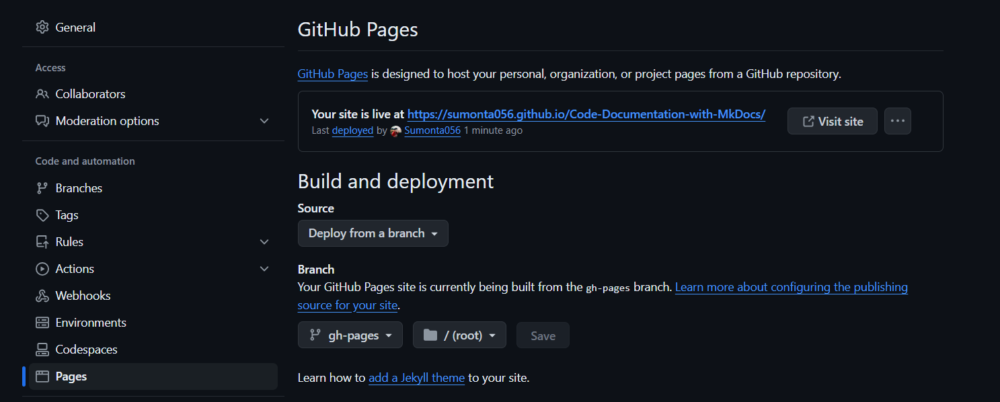

## Code Documentation With MkDocs

This is a simple example of how to use MkDocs to generate documentation for your code.

## Resources

- [MkDocs](https://squidfunk.github.io/mkdocs-material/getting-started/)
- [Material for MkDocs](https://squidfunk.github.io/mkdocs-material/)
- [How To Create STUNNING Code Documentation With MkDocs Material Theme](https://youtu.be/Q-YA_dA8C20?si=YV01u_LMFK4zi8a6)
- [Supporting code for the video](https://github.com/james-willett/mkdocs-material-youtube-tutorial/tree/main)

## Installation

To install MkDocs, run the following command:

- Create a virtual environment

```bash
python -m venv venv
```

- Activate the virtual environment

```bash
.\venv\Scripts\Activate
```

- Install MkDocs

```bash
pip install mkdocs-material
```

- Install Server

```bash
mkdocs new .
```

- Run the server

```bash
mkdocs serve
```

- Setup GitHub Pages


